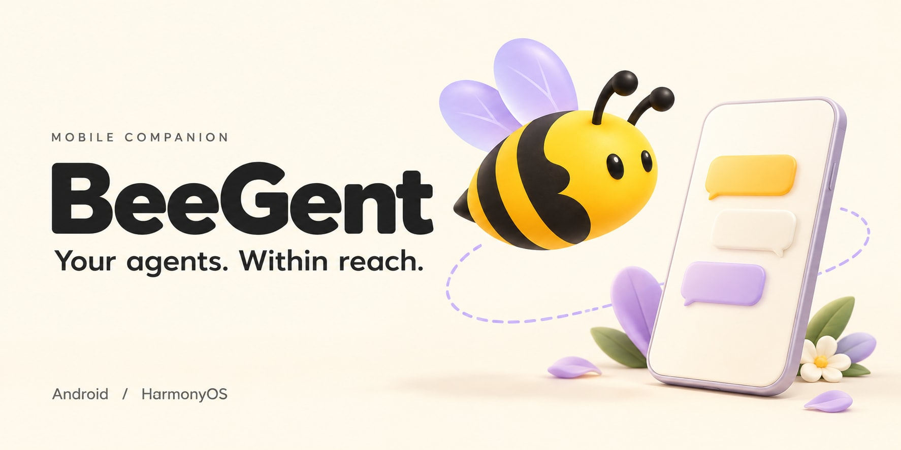
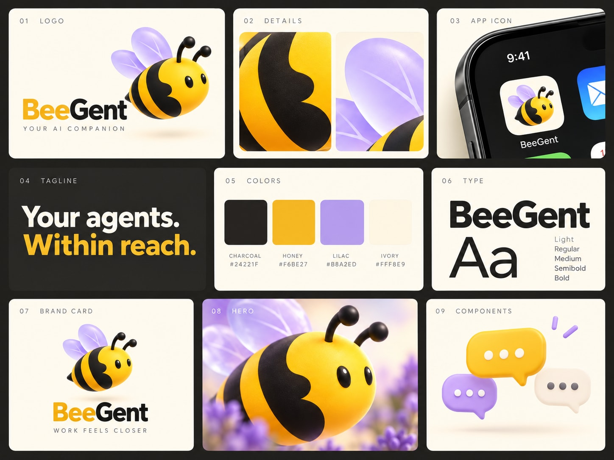

<p align="center"></p>
<h1 align="center">BeeGent</h1>
<p align="center"><strong>Your agents. Within reach.</strong></p>
<p align="center">A native mobile companion for WorkSwarm / JiuwenSwarm.</p>
<p align="center"><a href="README.md">简体中文</a> · <a href="https://github.com/XiaoLuoLYG/beegent/releases/tag/v0.2.0">Download v0.2.0 preview</a> · <a href="docs/BUILDING.md">Build</a> · <a href="https://github.com/XiaoLuoLYG/beegent/discussions">Discuss</a></p>



BeeGent brings your WorkSwarm / JiuwenSwarm sessions to your phone. While your computer runs the task, you can follow progress, send instructions, handle approvals and pick up the files it creates.

Available for Android and HarmonyOS. Connect to your computer over your local network.

[💬 Features](#features) · [📦 Download](#download) · [🔌 Get started](#connect) · [🛠️ Development](#development) · [🎨 Brand assets](#brand)

<a id="features"></a>

## 💬 What you can do

- Read streaming replies and Markdown, follow tool calls and subagent activity, and check task lists.
- Send messages while a task is running. Edit, reorder, pause or resume the queue, or send extra instructions directly to a running single-agent task.
- Answer questions, handle permission requests and approve plans.
- Open past sessions, receive files from your desktop, preview images and HTML, and save or share the results.

When creating a session, choose **Agent / Team**, **Work / Code** and **Normal / Plan**.

<a id="download"></a>

## 📦 Download

| Platform | v0.2.0 | Installation |
| --- | --- | --- |
| Android 8.0+ | [Download APK](https://github.com/XiaoLuoLYG/beegent/releases/download/v0.2.0/BeeGent-v0.2.0-android-debug.apk) | Ready to install; uses a debug signature |
| Android, with your own signature | [Unsigned APK](https://github.com/XiaoLuoLYG/beegent/releases/download/v0.2.0/BeeGent-v0.2.0-android-unsigned.apk) | Sign before installing |
| HarmonyOS | [Unsigned HAP](https://github.com/XiaoLuoLYG/beegent/releases/download/v0.2.0/BeeGent-v0.2.0-harmonyos-unsigned.hap) | Requires HarmonyOS signing and device authorization |

[All downloads and release notes](https://github.com/XiaoLuoLYG/beegent/releases/tag/v0.2.0) · [Changelog](CHANGELOG.md)

<a id="connect"></a>

## 🔌 Get started

1. Start **WorkSwarm / JiuwenSwarm** on your computer. If it only accepts connections from localhost, use the [LAN relay Skill](swarm/beegent-lan-relay.md) to connect your phone.
2. Join the same local network on both devices and enter your computer's **IPv4 address** in BeeGent. With the default relay, leave both port fields blank.
3. Open an existing session, or choose your modes and send a first message.

Your desktop runs the agents and handles model calls. Keep the computer and desktop service running.

<details>
<summary>Ports and connection details</summary>

The relay supports macOS, Windows and Linux. It requires Node.js 18+, with no npm dependencies.

| Purpose | Phone connects to | Desktop service |
| --- | --- | --- |
| Messages | `Computer IP:29000` | `127.0.0.1:19000` |
| File downloads | `Computer IP:25173` | `127.0.0.1:5173` |

If your desktop uses different ports, adjust the relay configuration to match.

Disconnecting the phone does not stop desktop tasks. Connection settings, drafts and unsent queues stay in memory for the current run. Disconnecting or switching sessions clears unsent queued messages; existing history can be read from the server after reconnecting.

Sending is text-only. Attachments are files received from your desktop. See the [Android](android/README.md) and [HarmonyOS](hos/README.md) guides for more detail.

</details>

Connections use WS / HTTP without login authentication. Use a trusted LAN and keep these ports off the public internet.

<a id="development"></a>

## 🛠️ Development and contributions

The Android client uses Kotlin / Jetpack Compose; the HarmonyOS client uses ArkTS / ArkUI. Open `android/` in Android Studio or `hos/` in DevEco Studio.

[Build guide](docs/BUILDING.md) · [Contributing](CONTRIBUTING.md) · [Report a problem](https://github.com/XiaoLuoLYG/beegent/issues/new/choose) · [Discussions](https://github.com/XiaoLuoLYG/beegent/discussions) · [Security](SECURITY.md)

<details>
<summary>Source directories</summary>

```text
android/    Android client
hos/        HarmonyOS client
swarm/      LAN relay Skill
docs/       Build documentation and brand assets
```

The default `android` branch contains both clients. The `hos` branch preserves the HarmonyOS development baseline.

</details>

<a id="brand"></a>

## 🎨 Brand assets

[App icon](docs/assets/brand/app-icon.png) · [Hero](docs/assets/brand/hero.jpg) · [Social cover](docs/assets/brand/social-preview.jpg) · [Download the asset pack](https://github.com/XiaoLuoLYG/beegent/releases/download/v0.2.0/BeeGent-v0.2.0-brand-assets.zip)

<details>
<summary>View the brand board</summary>



[Asset notes](docs/assets/brand/README.md)

</details>

## 🙌 Credits

BeeGent builds on the HarmonyOS client and relay tools in [kevinCsir/beegent](https://github.com/kevinCsir/beegent). Thanks to the original author and the WorkSwarm / JiuwenSwarm projects.

No open-source license has been declared for this repository. See [NOTICE](NOTICE) for attribution.
